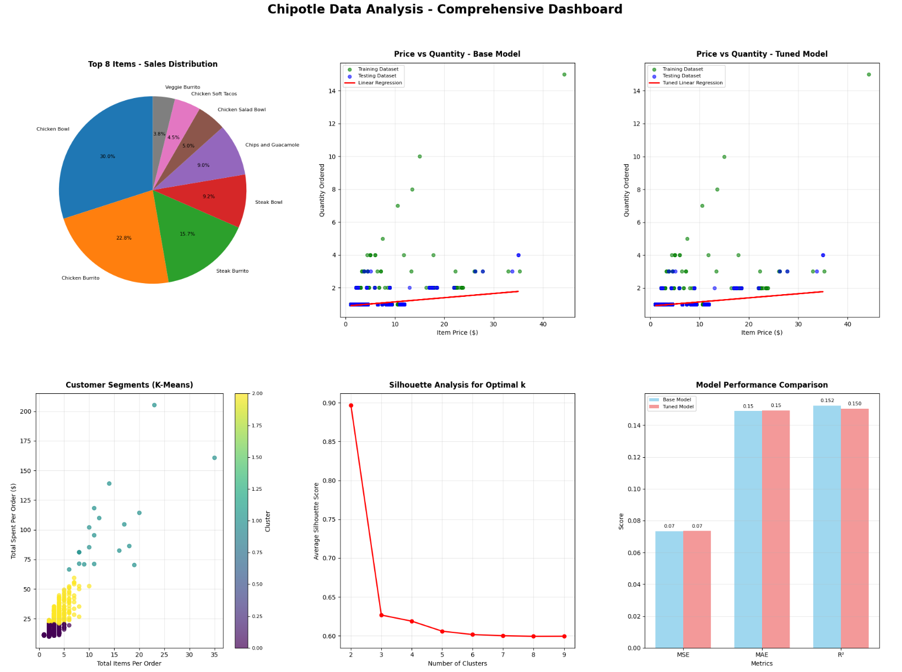

# Chipotle Data Analysis - Customer Segmentation & Sales Insights

A comprehensive data science project analyzing Chipotle transaction data to extract business insights through statistical analysis, machine learning, and customer segmentation.

## 🎯 Project Overview

This project demonstrates end-to-end data analysis capabilities including data preprocessing, exploratory data analysis, predictive modeling, and unsupervised learning techniques on real-world restaurant sales data.

## 🔧 Technologies Used

- **Python**: pandas, numpy, matplotlib, seaborn
- **Machine Learning**: scikit-learn (Linear Regression, K-Means Clustering)
- **Statistical Analysis**: Silhouette Analysis, GridSearchCV
- **Data Visualization**: Interactive plots and charts

## 📊 Key Analyses

### 1. Sales Performance Analysis
- Analyzed 4,600+ transaction records
- Identified top 10 revenue-generating menu items
- Created comprehensive sales distribution visualizations

### 2. Predictive Modeling
- **Base Linear Regression**: Predicted order quantities based on item pricing
- **Tuned Model**: Implemented hyperparameter optimization with GridSearchCV and StandardScaler
- **Model Evaluation**: MSE, MAE, and R² score comparisons

### 3. Customer Segmentation
- Applied K-Means clustering to segment customers by purchasing behavior
- Features: Total items per order vs. Total spending per order
- Identified 3 distinct customer segments for targeted marketing

### 4. Cluster Validation
- Conducted silhouette analysis across k=2 to k=9 clusters
- Determined optimal cluster configuration through quantitative validation
- Visualized cluster quality metrics for data-driven decision making

## 🚀 Business Impact

- **Customer Insights**: Segmented customers into actionable groups for targeted marketing
- **Sales Optimization**: Identified high-performing menu items for strategic focus
- **Predictive Capabilities**: Built models to forecast order patterns based on pricing

## 🔍 Key Skills Demonstrated

- Large dataset manipulation and cleaning
- Statistical analysis and data mining
- Machine learning model development and tuning
- Unsupervised learning and cluster validation
- Data visualization and business insight generation
